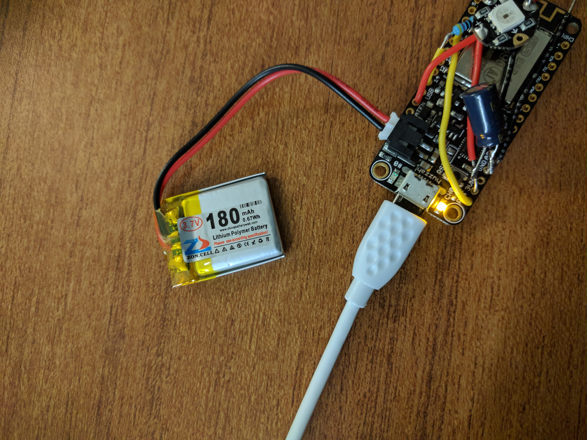

Some projects I'm working on that I can write about in case I run out of ideas:

* This blog (GatsbyJS, Netlify)
* Smart light-up tote bags (Arduino, Wearables, Sensors, C)
* Fridge - an app to track what's in my fridge so my veggies don't go to waste (Flutter, Android, iOS)
* A running tally of techy things I don't know or understand
* What I'm currently reading
