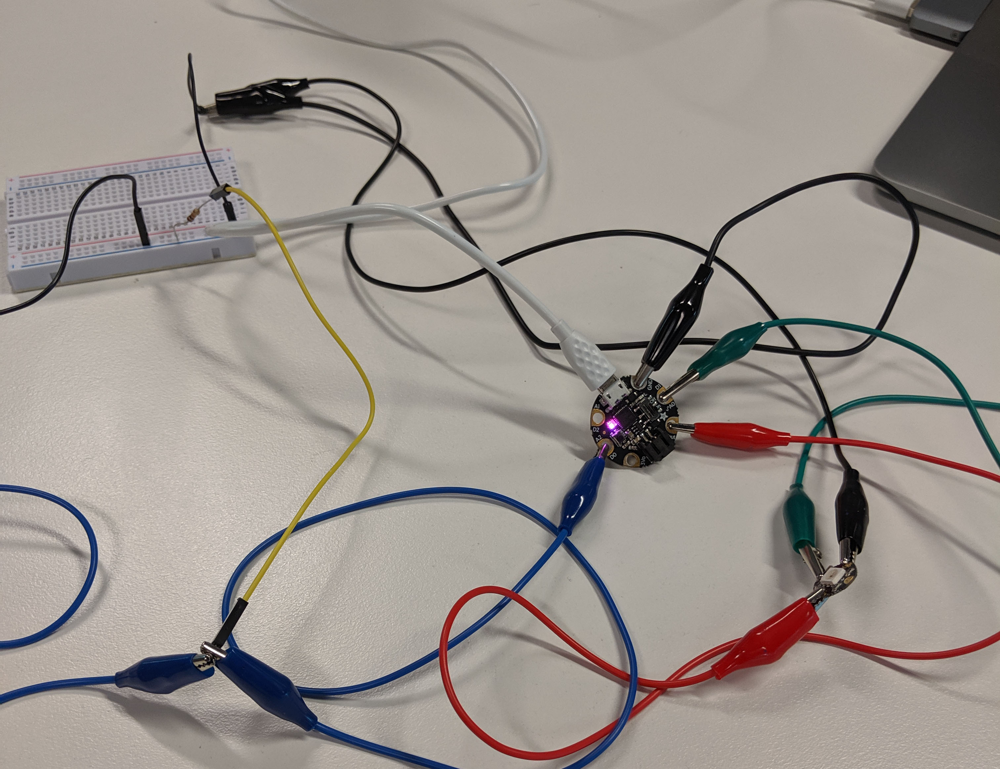

[Hopper Down Under](https://community.anitab.org/event/hopper-down-under/) invited [Inny](https://twitter.com/mini_inny) and me to present a workshop at the end of July, and we're super excited!

We did a version of this IoT workshop for the Grace Hopper Celebration of Women in Technology in Orlando back in 2017, and it was a resounding success if I do say so myself. The line don't lie:

Preparation for Orlando was done in a frantic rush, and we learned lots of lessons and burned lots of hair along the way.

This time, we're a lot calmer. We have a plan. Our hair is significantly less singed. We're nailing this conference prep business.

***

## The Initial Proposal

Our initial conference proposal for Hopper Down Under 2019 was to:

- Create a micro-controller enabled tote bag written in C equipped with a colour sensor.
- The LED lights on the tote bag would light up to match whatever you were looking for in the shops. Buying an orange? Bring it close to your bag, and see the lights on it light up!
- It would all be connected together with [Bare Conductive Paint](https://www.bareconductive.com/make/how-to-use-electric-paint-with-leds/) instead of wire circuitry - a true wearable electronics primer!
- Take workshop attendees through progressive steps on how to make the bag light up.

Seems simple enough, right? We thought so, so we started rapid prototyping.

*Alligator clips for days*

***

## Learnings (i.e. Hurdles, Challenges, Fuck-Ups)

It's been two months and we've already faced some interesting hurdles along the way.

* The microcontroller we wanted to use ([Adafruit Gemma M0](https://www.adafruit.com/product/3501)) wouldn't fit all the complicated and heavy colour sensor code and LED libraries on it. 😡
* Bare Conductive Paint on cloth conducts about as well as lines drawn in Sharpie 🤦🏽‍♀️
* The code was in C and quickly became too complicated for beginners 🤷🏽‍♀️

*Prototyping the colour sensor and accidentally developing an LED blink based language along the way*

***

## How The Initial Proposal Is Evolving

Inny and I adapt and adapt QUICKLY. It's what I love about us.

* **Analog Photocell Sensor > Digital Colour Sensor** 

  Our tote bag now comes equipped with an ambient light sensor. Too dark while you're out shopping? Never fear, the lights on your tote will automatically light up to show you the way.
  
  *Benefits: Simpler, cheaper circuit; Easier to code; All the code now fits on the microcontroller's memory;*

* **Conductive Tape > Conductive Paint** 

  We are using conductive tape instead of paint. The circuits that use tape look adorable.
  
  *Benefits: Resilient & robust circuitry; Easy to pre-assemble; Curious workshop attendees can also mess with the circuit on the day; Circuit looks cute af;*

* **Python > C** 

  [CircuitPython](https://circuitpython.org/) is a Python library which you can load onto your Adafruit Gemma M0 and it gives you a full Python REPL and dev capabilities.
  
  *Benefits: Hot reloading of code directly onto the microcontroller; Fast feedback; Better developer experience;*

***

## How It Looks Right Now

Here it is in all its prototypal glory. Notice Inny's hand simulating darkness by covering the photocell:

*Now to make 40 of these and put them on tote bags.*

***

## Things To Do In The Next Month 🏃🏽‍♀️

* Publishing the workshop tutorial materials!
* Make our IoT enabled tote bags!
* GIFs of our final tote bags!
* Show up at conference and do the thing!

***

## I've Been Tweeting A Lot - Follow Our Journey!

<blockquote class="twitter-tweet" data-lang="en">
Occasionally <a href="https://twitter.com/mini_inny?ref_src=twsrc%5Etfw">@mini_inny</a> will send me progress videos for how our <a href="https://twitter.com/hashtag/iot?src=hash&amp;ref_src=twsrc%5Etfw">#iot</a> <a href="https://twitter.com/hashtag/adafruit?src=hash&amp;ref_src=twsrc%5Etfw">#adafruit</a> tote bag prototyping is going and it&#39;ll make my day 😍 Now trying conductive tape for circuitry! Imagine shopping with this tote bag in the dark 💅 <a href="https://t.co/d3CA1SVSFp">pic.twitter.com/d3CA1SVSFp</a>
&mdash; Sreeja Gupta (@sreejagpt) <a href="https://twitter.com/sreejagpt/status/1140816502347710464?ref_src=twsrc%5Etfw">June 18, 2019</a></blockquote>

<blockquote class="twitter-tweet" data-lang="en">
A productive afternoon shifting bits and blinking LEDs. This little baby is going to be a light-up tote bag one day. I love prototyping. 😍 <a href="https://twitter.com/hashtag/wearabletech?src=hash&amp;ref_src=twsrc%5Etfw">#wearabletech</a> <a href="https://twitter.com/hashtag/iot?src=hash&amp;ref_src=twsrc%5Etfw">#iot</a> <a href="https://twitter.com/hashtag/adafruit?src=hash&amp;ref_src=twsrc%5Etfw">#adafruit</a> <a href="https://t.co/uTnKlEJQDB">pic.twitter.com/uTnKlEJQDB</a>
&mdash; Sreeja Gupta (@sreejagpt) <a href="https://twitter.com/sreejagpt/status/1132528442673573889?ref_src=twsrc%5Etfw">May 26, 2019</a></blockquote>

